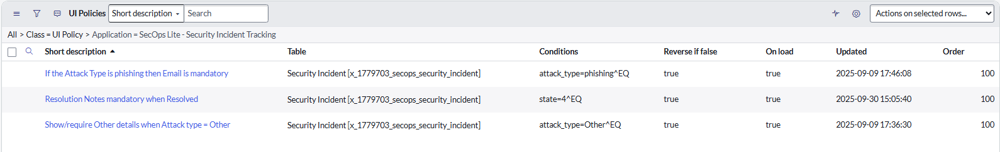
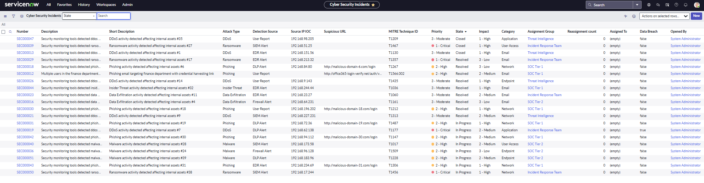

# 🛡️ ServiceNow Security Incident Tracker

A custom ServiceNow application built to simulate **SOC (Security Operations Center)** workflows and practice **CSA (Certified System Administrator)** concepts.

This app extends **ITSM principles** into a cybersecurity-oriented use case — tracking, analyzing, and resolving security incidents.

---

## 🚀 Features Implemented

### 🧩 Custom Security Incident Table
Designed to support core SOC workflows with specialized fields:
- **Attack type** (Phishing, Malware, Ransomware, etc.)
- **MITRE Technique ID**
- **Suspicious URL** & **IOC tracking**
- **Priority**, **Impact**, and **State**

### ⚙️ UI Policies
Dynamic behavior to improve data accuracy:
- When **Attack type = Phishing**, the **Email Header (raw)** field becomes **visible and mandatory**.
- When **State = Resolved**, the **Resolution Notes** field becomes **required**.
- When **Attack type = Other**, the **Other details** field is **shown**.

### 📂 Application Menu
Organized for efficient navigation:
- **Security Incidents** → List all incidents  
- **My Incidents** → View incidents assigned to the logged-in user  
- **New Security Incident** → Quickly create a new record  

### 🧭 Form Layout
Structured into intuitive sections:
1. **Incident Details** – Core ITSM fields  
2. **Threat Information** – Cybersecurity enrichment fields  
3. **Resolution Details** – Appears when the incident is resolved  
4. **Tracking** – For internal notes or related indicators  

### 🧑‍💻 Role-Based Structure
Includes roles for realistic SOC access control:
- **SOC Analyst**
- **SOC Manager**
- **Security Incident User**

---

## 📸 Screenshots (Current)

| Screenshot | Description |
|-------------|--------------|
| .png) | Custom form with Incident, Threat, and Resolution sections |
|  | UI Policies controlling visibility and mandatory logic |
| .png) | Incident form in “New” state |
| .png) | Resolution Notes field visible after resolving |
| .png) | Fully populated example record |
| .png) | Impersonation showing Test User view |
|  | List view summarizing all security incidents |

*(More screenshots such as dashboards or reports to be added later.)*

---

## 🛠 Next Steps (Work in Progress)

Planned enhancements to make the app more realistic and practical:

- 🔒 **Access Controls (ACLs)** → SOC Analyst vs SOC Manager permissions  
- 📊 **Reports & Dashboards** → e.g., *Incidents by Attack Type*, *Incidents by Priority*  
- 🎛 **List Layout Optimization** → Cleaner columns (*Number*, *Short Description*, *Priority*, *State*, *Attack Type*)  
- ➕ **Additional UI Policies** → e.g., *MITRE ID required for Malware cases*  

---

## 🎯 Why This Project Matters

This project demonstrates how **ServiceNow** can be customized for **cybersecurity use cases** beyond ITSM — bridging IT operations with security operations.

It highlights hands-on experience with:
- Scoped application creation  
- Custom tables, fields, and roles  
- UI policy design and dynamic field logic  
- Form and menu structuring  
- Role-based visibility and impersonation testing  

---

## 📂 Project Structure

